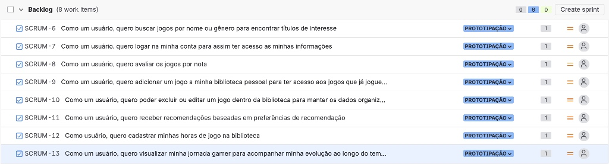
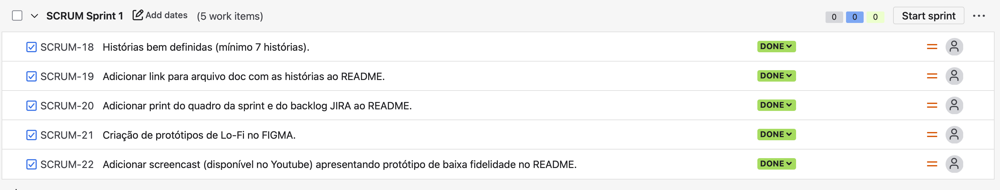

# JoyScore 🎮

## 🕹️ Visão Geral do Projeto

O **JoyScore** é um aplicativo web criado para auxiliar os jogadores a gerenciar sua biblioteca de jogos de forma organizada e eficiente. Nossa missão é oferecer uma experiência completa, permitindo que você catalogue seus jogos, monitore o tempo de gameplay, avalie títulos e, o mais importante, descubra novas aventuras com recomendações personalizadas!

Buscamos ir além do simples gerenciamento, criando uma plataforma onde a avaliação da comunidade é a bússola para novas descobertas. Com o **JoyScore**, a jornada do jogador se torna mais informada e divertida, garantindo que cada novo título adicionado à sua lista seja uma aposta certeira.

---

## 🚀 Funcionalidades Chave

* **Gerenciamento da Biblioteca de Jogos**: Adicione, edite e organize seus jogos em um só lugar.
* **Controle de Horas Jogadas**: Registre o tempo dedicado a cada jogo para ter um panorama completo da sua jornada.
* **Sistema de Avaliação (Notas)**: Dê notas aos jogos que você joga e veja as avaliações de outros usuários para guiar suas escolhas.
* **Recomendações Personalizadas**: Receba sugestões de jogos baseadas no seu histórico de avaliações e nas preferências da comunidade.
* **Interface Intuitiva**: Um design limpo e fácil de usar para uma experiência de navegação agradável.

---
## 🔗 Links Importantes
* [JIRA](https://cesar-team-xgeehtz9.atlassian.net/jira/software/projects/SCRUM/boards/1)
* [FIGMA](https://www.figma.com/team_invite/redeem/uNprfevO6ROzst63JGn8dA)

---

## 🎯 Entregas do Projeto

### Sprint 1
* [x] Criação da estrutura inicial do projeto (repositório, `README.md`).
* [x] Histórias bem definidas com cenários de validação usando BDD.
* [ ] Criação de protótipos de Lo-Fi no `figma`
* [DOCS das histórias](https://docs.google.com/document/d/1Do4L12gQj98wIq89vcKbAmj7p11cPLGHfdSs3oQpDPo/edit?tab=t.0)

### Sprint 2
* [ ] Seleção de 3 histórias para implementar.
* [ ] Ambiente de versionamento atuante.
* [ ] Issue/bug tracker atualizado.
* [ ] Deployment das histórias em produção.
* [ ] Programação em Par experimentada.
* [ ] Quadro da `Sprint 02` atualizado refletindo a entrega.

### Sprint 3
* [ ] Seleção de mais histórias para implementar.
* [ ] Ambiente de versionamento atuante.
* [ ] Deployment das novas histórias.
* [ ] Issue/bug tracker atualizado.
* [ ] CI/CD com build e deployment automatizado.
* [ ] Testes de Sistema `E2E` Automatizados.
* [ ] Atualização sobre o uso da programação em pares.
* [ ] Quadro da `Sprint 03` atualizado refletindo a entrega.

### Sprint 4
* [ ] Implementação das histórias restantes.
* [ ] Ambiente de versionamento atuante.
* [ ] Deployment das novas histórias.
* [ ] Uso do Issue/bug tracker.
* [ ] Testes de Sistema `E2E` automatizados.
* [ ] CI/CD com build e deployment automatizado.
* [ ] Atualização sobre o uso da programação em pares.
* [ ] Quadro da `Sprint 04` atualizado refletindo a entrega.

---

## 📅 Backlog e Quadros das Sprints

* **Backlog do Projeto (Jira)**:
    

* **Quadro da Sprint 1 (Jira)**:
    

* **Quadro da Sprint 2 (Jira)**:
    

---
