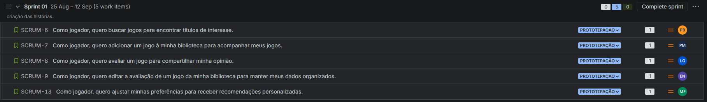
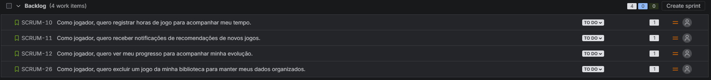
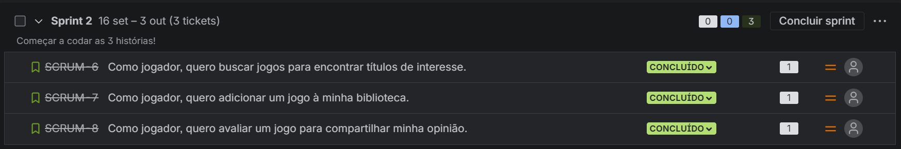
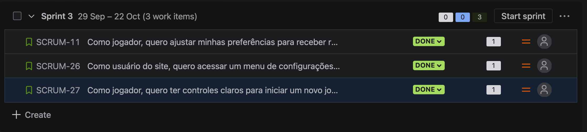

# JoyScore 🎮

## 🕹️ Visão Geral do Projeto

O **JoyScore** é um aplicativo web criado para auxiliar os jogadores a gerenciar sua biblioteca de jogos de forma organizada e eficiente. Nossa missão é oferecer uma experiência completa, permitindo que você catalogue seus jogos, monitore o tempo de gameplay, avalie títulos e, o mais importante, descubra novas aventuras com recomendações personalizadas!

Buscamos ir além do simples gerenciamento, criando uma plataforma onde a avaliação da comunidade é a bússola para novas descobertas. Com o **JoyScore**, a jornada do jogador se torna mais informada e divertida, garantindo que cada novo título adicionado à sua lista seja uma aposta certeira.

---

## 🚀 Funcionalidades Chave

* **Gerenciamento da Biblioteca de Jogos**: Adicione, edite e organize seus jogos em um só lugar.
* **Controle de Horas Jogadas**: Registre o tempo dedicado a cada jogo para ter um panorama completo da sua jornada.
* **Sistema de Avaliação (Notas)**: Dê notas aos jogos que você joga e veja as avaliações de outros usuários para guiar suas escolhas.
* **Recomendações Personalizadas**: Receba sugestões de jogos baseadas no seu histórico de avaliações e nas preferências da comunidade.
* **Interface Intuitiva**: Um design limpo e fácil de usar para uma experiência de navegação agradável.

---
## 🔗 Links Importantes
* [JIRA](https://cesar-team-xgeehtz9.atlassian.net/jira/software/projects/SCRUM/boards/1)
* [FIGMA](https://www.figma.com/team_invite/redeem/uNprfevO6ROzst63JGn8dA)

---

## 🎯 Entregas do Projeto

<h3><b>Sprint 1</b></h3>

<ul>
<li>Criação da estrutura inicial do projeto (repositório README.md).✅</li>
<li>Histórias bem definidas com cenários de validação usando BDD.✅</li>
<li>Criação de protótipos de Lo-Fi no FIGMA.✅</li>
<li>Adicionar screencast no Youtube apresentando protótipo de baixa fidelidade.✅</li>
<li><a href="https://docs.google.com/document/d/1Do4L12gQj98wIq89vcKbAmj7p11cPLGHfdSs3oQpDPo/edit?tab=t.0">DOCS das histórias</a></li>
<li><a href="https://www.figma.com/design/MzaHIchF8uLwNGaZ5YyXol/Prot%C3%B3tipo-de-Lo-fi?node-id=7-4&p=f&t=9L0frUt6vO77NQqT-0">FIGMA das histórias</a></li>
<li><a href="https://youtu.be/UO0U4fJKBno">Vídeo do protótipo de Lo-fi</a></li>
</ul>

  

  

<h3><b>Sprint 2</b></h3>

<ul>
<li>Seleção de 3 histórias para implementar.✅</li>
<li>Ambiente de versionamento atuante.✅</li>
<li>Issue/bug tracker atualizado.✅</li>
<li>Deployment das histórias em produção.✅</li>
<li>Adicionar screencast no Youtube do uso do sistema.✅</li>
<li>Programação em Par experimentada✅</li>
<li>Quadro da Sprint 02 atualizado refletindo a entrega.✅</li>
<li><a href="https://docs.google.com/document/d/1cLlLR55E9F2QSTH3upHOF6-ahyTImWCMaRnRvmUL4mg/edit?tab=t.0">Relatório de programação em par </a></li>
<li><a href="https://youtu.be/MG5x-7HTrK4">Vídeo de teste das primeiras histórias implementadas</a></li>
<li><a href="https://lcsbayma.pythonanywhere.com/">Link do site JoyScore</a></li>
</ul>
  

  

<h3><b>Sprint 3</b></h3>

<ul>
<li>Seleção de mais histórias para implementar.✅</li>
<li>Ambiente de versionamento atuante.✅</li>
<li>Deployment das novas histórias.✅</li>
<li>Adicionar novo screencast com ênfase nas novas histórias.</li>
<li>Issue/bug tracker atualizado.✅</li>
<li>CI/CD com build e deployment automatizado.✅</li>
<li>Testes de Sistema E2E Automatizados.</li>
<li>Atualização sobre o uso da programação em pares.✅</li>
<li>Quadro da Sprint 03 atualizado refletindo a entrega.✅</li>
</ul>
  <li><a href="https://docs.google.com/document/d/1cLlLR55E9F2QSTH3upHOF6-ahyTImWCMaRnRvmUL4mg/edit?tab=t.0">Relatório de programação em par </a></li>
  <li><a href="https://lcsbayma.pythonanywhere.com/">Link do site JoyScore</a></li>
  

  

<h3><b>Sprint 4</b></h3>

<ul>
<li>Implementação das histórias restantes.</li>
<li>Ambiente de versionamento atuante.</li>
<li>Deployment das novas histórias.</li>
<li>Uso do Issue/bug tracker.</li>
<li>Testes de Sistema E2E automatizados.</li>
<li>CI/CD com build e deployment automatizado.</li>
<li>Atualização sobre o uso da programação em pares.</li>
<li>Quadro da Sprint 04 atualizado refletindo a entrega.</li>
</ul>

## 👥 Equipe de Desenvolvimento 

Agradecimentos especiais a todas as pessoas que contribuíram com este projeto 💜

* **Eros Amâncio Nascimento** - [@erosamancio](https://github.com/erosamancio)
* **Lucas Coutinho de Almeida Bayma** - [@lucascbaymma](https://github.com/lucascbayma)
* **Luiz Felipe Siqueira** - [@LuizNoCode](https://github.com/LuizNoCode)
* **Mateus Lins Farias** - [@mateuslinsf](https://github.com/mateuslinsf)
* **Pedro David Oliveira Baia** - [@Pedrodavidob](https://github.com/Pedrodavidob)
* **Pedro Moreira** - [@PedroMoreira18](https://github.com/PedroMoreira18)
  
